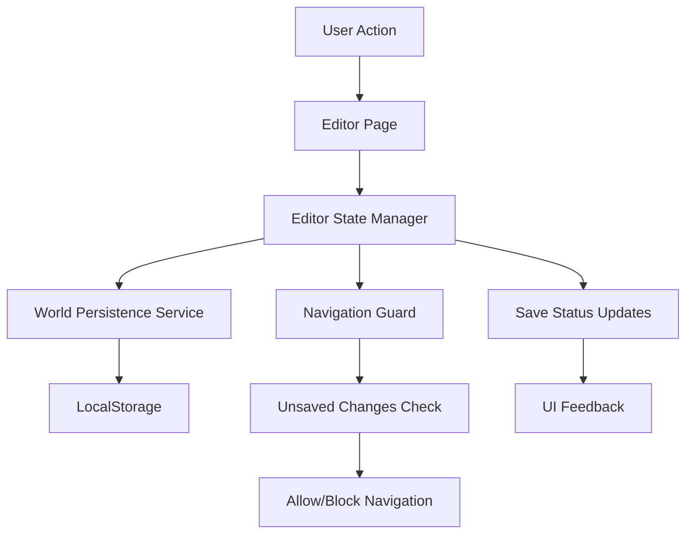

# Design Document

## Overview

This design addresses critical usability issues in the World History Simulation Engine's editor system by implementing a cohesive navigation system, consistent UI patterns, proper data persistence, and missing functionality. The solution focuses on creating a seamless workflow that guides users through the world-building process while maintaining their work and providing clear feedback.

## Architecture

### Component Architecture

The editor system follows a layered architecture with clear separation of concerns:

```
Presentation Layer
├── Pages (Editor Pages)
│   ├── WorldFoundationEditorPage (Enhanced)
│   ├── NodeEditorPage (Enhanced)
│   ├── CharacterEditorPage (Enhanced)
│   ├── InteractionEditorPage (Enhanced)
│   └── EncounterEditorPage (New)
├── Components (Shared UI)
│   ├── EditorNavigation (New)
│   ├── EditorLayout (New)
│   ├── SaveStatusIndicator (New)
│   └── WorldSelector (New)
└── Hooks
    ├── useEditorNavigation (New)
    ├── useWorldPersistence (New)
    └── useUnsavedChanges (New)

Application Layer
├── EditorStateManager (New)
├── WorldPersistenceService (Enhanced)
└── NavigationGuard (New)

Domain Layer
├── World (Enhanced)
├── Node (Enhanced)
├── Character (Enhanced)
├── Interaction (Enhanced)
└── Encounter (New)
```

### Data Flow Architecture



## Components and Interfaces

### 1. Enhanced Editor Navigation System

#### EditorNavigation Component
```typescript
interface EditorNavigationProps {
  currentEditor: EditorType;
  worldExists: boolean;
  hasUnsavedChanges: boolean;
  onNavigate: (editor: EditorType) => void;
}

interface EditorType {
  id: 'world' | 'nodes' | 'characters' | 'interactions' | 'encounters';
  name: string;
  path: string;
  requiresWorld: boolean;
  icon: ReactNode;
}
```

#### Navigation Flow
- World Foundation Editor → Node Editor → Character Editor → Interaction Editor → Encounter Editor
- Each editor checks for world foundation completion before allowing access
- Navigation warnings for unsaved changes
- Breadcrumb navigation showing current position

### 2. Consistent Button Alignment System

#### ButtonGroup Component
```typescript
interface ButtonGroupProps {
  alignment: 'left' | 'center' | 'right';
  buttons: ButtonConfig[];
  variant: 'primary' | 'secondary' | 'danger';
}

interface ButtonConfig {
  id: string;
  label: string;
  icon?: ReactNode;
  onClick: () => void;
  disabled?: boolean;
  loading?: boolean;
}
```

#### Alignment Rules
- **World, Node, Character Editors**: Center-aligned buttons
- **Interaction Editor**: Maintain current left alignment
- **All Editors**: Consistent spacing, sizing, and hover states

### 3. Enhanced World and Node Persistence

#### WorldPersistenceService
```typescript
interface WorldPersistenceService {
  saveWorld(world: World): Promise<void>;
  loadWorld(worldId: string): Promise<World>;
  getAllWorlds(): Promise<World[]>;
  deleteWorld(worldId: string): Promise<void>;
  saveNode(worldId: string, node: Node): Promise<void>;
  getWorldNodes(worldId: string): Promise<Node[]>;
  hasUnsavedChanges(worldId: string): boolean;
}

interface World {
  id: string;
  name: string;
  description: string;
  rules: WorldRules;
  initialConditions: InitialConditions;
  nodes: Node[];
  characters: Character[];
  interactions: Interaction[];
  encounters: Encounter[];
  lastModified: Date;
  version: number;
}
```

#### Storage Strategy
- **Primary Storage**: localStorage for immediate persistence
- **Backup Strategy**: Export/import functionality for data portability
- **Versioning**: Track world versions for future migration support
- **Validation**: Ensure data integrity on load/save operations

### 4. World and Node Selection System

#### WorldSelector Component
```typescript
interface WorldSelectorProps {
  onWorldSelect: (world: World) => void;
  onCreateNew: () => void;
  currentWorldId?: string;
}

interface WorldListItem {
  id: string;
  name: string;
  description: string;
  lastModified: Date;
  nodeCount: number;
  characterCount: number;
  completionStatus: 'incomplete' | 'ready' | 'complete';
}
```

#### Selection Flow
1. **World Foundation Editor**: Show world selector on load
2. **Node Editor**: Show node selector for current world
3. **Character Editor**: Show character selector for current world
4. **Create New**: Always available option
5. **Quick Switch**: Dropdown for rapid world switching

### 5. Encounter System Integration

#### Encounter Entity
```typescript
interface Encounter {
  id: string;
  name: string;
  description: string;
  type: 'combat' | 'social' | 'exploration' | 'puzzle' | 'environmental';
  triggers: EncounterTrigger[];
  participants: ParticipantRequirement[];
  outcomes: EncounterOutcome[];
  difficulty: 'trivial' | 'easy' | 'medium' | 'hard' | 'deadly';
  nodeRestrictions?: string[]; // Node IDs where this encounter can occur
  prerequisites: Prerequisite[];
  rewards: Reward[];
  cooldown?: number;
}

interface EncounterTrigger {
  type: 'time' | 'location' | 'interaction' | 'condition';
  condition: string;
  probability: number;
}
```

#### Integration with Interaction System
- Encounters use the existing interaction framework for resolution
- Encounter outcomes generate interaction branches
- Shared effect system for consistent state changes
- Template system for reusable encounter patterns

## Data Models

### Enhanced World Model
```typescript
interface World {
  // Core properties
  id: string;
  name: string;
  description: string;
  
  // Configuration
  rules: {
    timeProgression: TimeProgressionSettings;
    simulationParams: SimulationParameters;
    customRules: string[];
  };
  
  initialConditions: {
    startingYear: number;
    season: 'spring' | 'summer' | 'autumn' | 'winter';
    globalEvents: string[];
    worldModifiers: WorldModifier[];
  };
  
  // Content
  nodes: Node[];
  characters: Character[];
  interactions: Interaction[];
  encounters: Encounter[];
  
  // Metadata
  lastModified: Date;
  version: number;
  isComplete: boolean;
  saveStatus: 'saved' | 'saving' | 'unsaved' | 'error';
}
```

### Editor State Model
```typescript
interface EditorState {
  currentWorld: World | null;
  currentEditor: EditorType;
  hasUnsavedChanges: boolean;
  saveStatus: SaveStatus;
  validationErrors: ValidationError[];
  navigationHistory: EditorType[];
}

interface SaveStatus {
  status: 'idle' | 'saving' | 'saved' | 'error';
  message?: string;
  timestamp?: Date;
}
```

## Error Handling

### Validation Strategy
1. **Real-time Validation**: Immediate feedback on form changes
2. **Save Validation**: Comprehensive checks before persistence
3. **Navigation Validation**: Prevent navigation with critical errors
4. **Data Integrity**: Validate loaded data for corruption

### Error Recovery
- **Auto-save Recovery**: Restore from auto-saved data on crash
- **Validation Guidance**: Clear instructions for fixing errors
- **Graceful Degradation**: Continue operation with non-critical errors
- **Export Fallback**: Always allow data export even with errors

## Testing Strategy

### Unit Testing
- **Component Testing**: All new components with React Testing Library
- **Service Testing**: Persistence and navigation services
- **Hook Testing**: Custom hooks with proper mocking
- **Validation Testing**: All validation rules and edge cases

### Integration Testing
- **Navigation Flow**: Complete editor-to-editor navigation
- **Save/Load Cycle**: Data persistence and retrieval
- **Cross-Editor State**: Shared state between editors
- **Error Scenarios**: Network failures, storage limits, data corruption

### User Acceptance Testing
- **Workflow Testing**: Complete world creation process
- **Usability Testing**: Button alignment and navigation clarity
- **Performance Testing**: Large world handling and save times
- **Accessibility Testing**: Keyboard navigation and screen readers

## Implementation Phases

### Phase 1: Core Infrastructure
1. **EditorStateManager**: Central state management
2. **WorldPersistenceService**: Enhanced save/load functionality
3. **NavigationGuard**: Unsaved changes protection
4. **EditorLayout**: Consistent layout wrapper

### Phase 2: Navigation System
1. **EditorNavigation**: Unified navigation component
2. **WorldSelector**: World selection interface
3. **Breadcrumb System**: Current location indication
4. **Navigation Hooks**: useEditorNavigation, useUnsavedChanges

### Phase 3: UI Consistency
1. **Button Alignment**: Center alignment for most editors
2. **Save Status Indicators**: Consistent feedback across editors
3. **Validation Display**: Unified error presentation
4. **Loading States**: Consistent loading indicators

### Phase 4: Enhanced Functionality
1. **Node Save Integration**: Proper node persistence
2. **World Selection**: Choose from existing worlds
3. **Auto-save System**: Background saving with recovery
4. **Export/Import**: Data portability features

### Phase 5: Encounter System
1. **Encounter Entity**: Core encounter model
2. **EncounterEditor**: Full-featured encounter editor
3. **Integration**: Connect with interaction system
4. **Templates**: Reusable encounter patterns

## Performance Considerations

### Optimization Strategies
- **Lazy Loading**: Load editor components on demand
- **Debounced Saves**: Prevent excessive save operations
- **Memoization**: Cache expensive computations
- **Virtual Scrolling**: Handle large lists efficiently

### Memory Management
- **Component Cleanup**: Proper useEffect cleanup
- **Event Listener Management**: Remove listeners on unmount
- **Large Data Handling**: Pagination for extensive content
- **Storage Limits**: Monitor localStorage usage

## Security Considerations

### Data Protection
- **Input Sanitization**: Prevent XSS in user content
- **Storage Encryption**: Consider encrypting sensitive data
- **Export Security**: Safe file generation and download
- **Import Validation**: Validate imported data structure

### User Safety
- **Confirmation Dialogs**: Prevent accidental data loss
- **Backup Strategies**: Multiple save points
- **Recovery Options**: Undo/redo functionality
- **Error Boundaries**: Graceful error handling

This design provides a comprehensive solution to the editor system issues while maintaining the existing architecture and ensuring a smooth user experience throughout the world-building process.