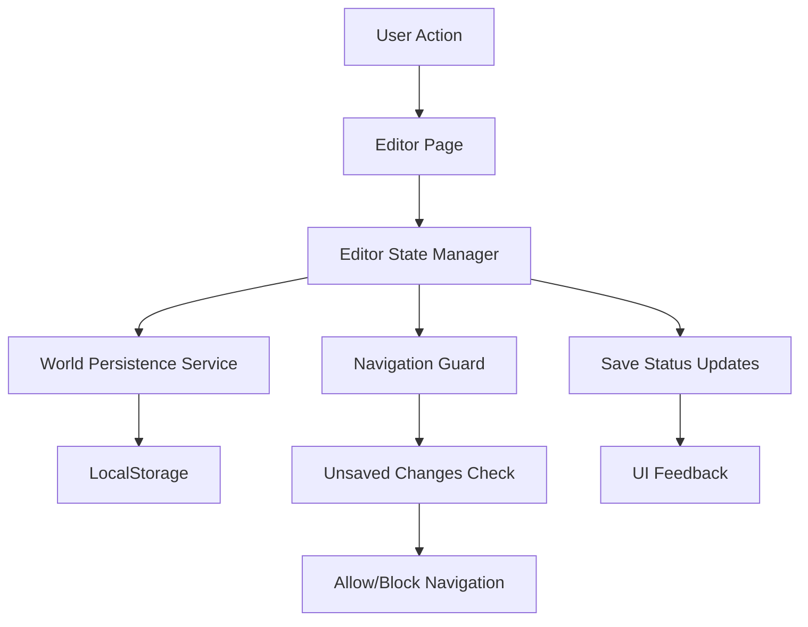

# Design Document

## Overview

This design addresses critical usability issues in the World History Simulation Engine's editor system by implementing a unified navigation system, fixing layout alignment issues, and eliminating redundant navigation elements. The solution focuses on creating a clean, single-navigation experience where editors display as full-width, center-aligned content with the global sidebar as the primary navigation method. Key fixes include removing multiple navigation systems, fixing left-aligned editor layouts, and ensuring the "Editors" button properly navigates to the World Foundation editor.

## Architecture

### Component Architecture

The editor system follows a layered architecture with clear separation of concerns:

```
Presentation Layer
├── Pages (Editor Pages)
│   ├── WorldFoundationEditorPage (Enhanced)
│   ├── NodeEditorPage (Enhanced)
│   ├── CharacterEditorPage (Enhanced)
│   ├── InteractionEditorPage (Enhanced)
│   └── EncounterEditorPage (New)
├── Components (Shared UI)
│   ├── EditorNavigation (New)
│   ├── EditorLayout (New)
│   ├── SaveStatusIndicator (New)
│   └── WorldSelector (New)
└── Hooks
    ├── useEditorNavigation (New)
    ├── useWorldPersistence (New)
    └── useUnsavedChanges (New)

Application Layer
├── EditorStateManager (New)
├── WorldPersistenceService (Enhanced)
└── NavigationGuard (New)

Domain Layer
├── World (Enhanced)
├── Node (Enhanced)
├── Character (Enhanced)
├── Interaction (Enhanced)
└── Encounter (New)
```

### Data Flow Architecture


```mermaid
graph TD
    A[User Action] --> B[Editor Page]
    B --> C[Editor State Manager]
    C --> D[World Persistence Service]
    D --> E[LocalStorage]
    C --> F[Navigation Guard]
    F --> G[Unsaved Changes Check]
    G --> H[Allow/Block Navigation]
    C --> I[Save Status Updates]
    I --> J[UI Feedback]
```

## Components and Interfaces

### 1. Unified Single Navigation System

#### Navigation Architecture
The system will use **only the global sidebar** for navigation, eliminating all other navigation elements:

```typescript
interface NavigationSystem {
  globalSidebar: {
    isAccessible: boolean; // Always accessible from all pages
    contains: ['EditorNavigation', 'WorldSelector', 'ContextualTools'];
  };
  topNavigation: {
    status: 'removed'; // No longer used in editor pages
  };
  editorSpecificNavigation: {
    status: 'removed'; // No longer displayed above editor content
  };
  breadcrumbs: {
    location: 'within_sidebar'; // Only in sidebar, not as separate element
  };
}
```

#### Single Navigation Flow
- **Global Sidebar Only**: All navigation happens through the sidebar
- **"Editors" Button Fix**: Routes to `/builder` (World Foundation)
- **No Redundant Navigation**: Remove top nav and editor-specific nav from editor pages
- **Sidebar Always Accessible**: Can be opened from any editor page

### 2. Full-Width Editor Layout System

#### Layout Architecture
Fix the left-aligned sidebar appearance of editors by implementing full-width layouts:

```typescript
interface EditorLayoutSystem {
  editorContainer: {
    width: '100%';
    maxWidth: 'none'; // Remove sidebar-like constraints
    margin: '0 auto'; // Center the content
    padding: 'responsive'; // Proper spacing on all sides
  };
  contentAlignment: {
    default: 'center'; // All editors center-aligned
    interaction: 'left'; // Exception for interaction editor
  };
  navigationRemoval: {
    topNav: 'hidden'; // Remove from editor pages
    editorNav: 'hidden'; // Remove editor-specific nav bars
    breadcrumbs: 'sidebar_only'; // Only show in sidebar
  };
}
```

#### Layout Rules
- **Full-Width Content**: Editors use entire available width
- **Center Alignment**: Content centered, not left-aligned like sidebar
- **No Navigation Overlap**: Remove redundant navigation elements
- **Responsive Design**: Proper spacing and alignment on all screen sizes

### 3. Enhanced World and Node Persistence

#### WorldPersistenceService
```typescript
interface WorldPersistenceService {
  saveWorld(world: World): Promise<void>;
  loadWorld(worldId: string): Promise<World>;
  getAllWorlds(): Promise<World[]>;
  deleteWorld(worldId: string): Promise<void>;
  saveNode(worldId: string, node: Node): Promise<void>;
  getWorldNodes(worldId: string): Promise<Node[]>;
  hasUnsavedChanges(worldId: string): boolean;
}

interface World {
  id: string;
  name: string;
  description: string;
  rules: WorldRules;
  initialConditions: InitialConditions;
  nodes: Node[];
  characters: Character[];
  interactions: Interaction[];
  encounters: Encounter[];
  lastModified: Date;
  version: number;
}
```

#### Storage Strategy
- **Primary Storage**: localStorage for immediate persistence
- **Backup Strategy**: Export/import functionality for data portability
- **Versioning**: Track world versions for future migration support
- **Validation**: Ensure data integrity on load/save operations

### 4. World and Node Selection System

#### WorldSelector Component
```typescript
interface WorldSelectorProps {
  onWorldSelect: (world: World) => void;
  onCreateNew: () => void;
  currentWorldId?: string;
}

interface WorldListItem {
  id: string;
  name: string;
  description: string;
  lastModified: Date;
  nodeCount: number;
  characterCount: number;
  completionStatus: 'incomplete' | 'ready' | 'complete';
}
```

#### Selection Flow
1. **World Foundation Editor**: Show world selector on load
2. **Node Editor**: Show node selector for current world
3. **Character Editor**: Show character selector for current world
4. **Create New**: Always available option
5. **Quick Switch**: Dropdown for rapid world switching

### 5. Encounter System Integration

#### Encounter Entity
```typescript
interface Encounter {
  id: string;
  name: string;
  description: string;
  type: 'combat' | 'social' | 'exploration' | 'puzzle' | 'environmental';
  triggers: EncounterTrigger[];
  participants: ParticipantRequirement[];
  outcomes: EncounterOutcome[];
  difficulty: 'trivial' | 'easy' | 'medium' | 'hard' | 'deadly';
  nodeRestrictions?: string[]; // Node IDs where this encounter can occur
  prerequisites: Prerequisite[];
  rewards: Reward[];
  cooldown?: number;
}

interface EncounterTrigger {
  type: 'time' | 'location' | 'interaction' | 'condition';
  condition: string;
  probability: number;
}
```

#### Integration with Interaction System
- Encounters use the existing interaction framework for resolution
- Encounter outcomes generate interaction branches
- Shared effect system for consistent state changes
- Template system for reusable encounter patterns

## Data Models

### Enhanced World Model
```typescript
interface World {
  // Core properties
  id: string;
  name: string;
  description: string;
  
  // Configuration
  rules: {
    timeProgression: TimeProgressionSettings;
    simulationParams: SimulationParameters;
    customRules: string[];
  };
  
  initialConditions: {
    startingYear: number;
    season: 'spring' | 'summer' | 'autumn' | 'winter';
    globalEvents: string[];
    worldModifiers: WorldModifier[];
  };
  
  // Content
  nodes: Node[];
  characters: Character[];
  interactions: Interaction[];
  encounters: Encounter[];
  
  // Metadata
  lastModified: Date;
  version: number;
  isComplete: boolean;
  saveStatus: 'saved' | 'saving' | 'unsaved' | 'error';
}
```

### Editor State Model
```typescript
interface EditorState {
  currentWorld: World | null;
  currentEditor: EditorType;
  hasUnsavedChanges: boolean;
  saveStatus: SaveStatus;
  validationErrors: ValidationError[];
  navigationHistory: EditorType[];
}

interface SaveStatus {
  status: 'idle' | 'saving' | 'saved' | 'error';
  message?: string;
  timestamp?: Date;
}
```

## Error Handling

### Validation Strategy
1. **Real-time Validation**: Immediate feedback on form changes
2. **Save Validation**: Comprehensive checks before persistence
3. **Navigation Validation**: Prevent navigation with critical errors
4. **Data Integrity**: Validate loaded data for corruption

### Error Recovery
- **Auto-save Recovery**: Restore from auto-saved data on crash
- **Validation Guidance**: Clear instructions for fixing errors
- **Graceful Degradation**: Continue operation with non-critical errors
- **Export Fallback**: Always allow data export even with errors

## Testing Strategy

### Unit Testing
- **Component Testing**: All new components with React Testing Library
- **Service Testing**: Persistence and navigation services
- **Hook Testing**: Custom hooks with proper mocking
- **Validation Testing**: All validation rules and edge cases

### Integration Testing
- **Navigation Flow**: Complete editor-to-editor navigation
- **Save/Load Cycle**: Data persistence and retrieval
- **Cross-Editor State**: Shared state between editors
- **Error Scenarios**: Network failures, storage limits, data corruption

### User Acceptance Testing
- **Workflow Testing**: Complete world creation process
- **Usability Testing**: Button alignment and navigation clarity
- **Performance Testing**: Large world handling and save times
- **Accessibility Testing**: Keyboard navigation and screen readers

### 6. Navigation Cleanup and "Editors" Button Fix

#### Navigation Element Removal
```typescript
interface NavigationCleanup {
  elementsToRemove: [
    'topNavigationInEditors',
    'editorSpecificNavBars', 
    'redundantBreadcrumbs',
    'mobileNavigationDuplicates'
  ];
  elementsToFix: {
    editorsButton: {
      currentPath: '/editors/nodes'; // Non-functional
      newPath: '/builder'; // World Foundation
      newLabel: 'World Foundation';
    };
  };
  sidebarAccess: {
    availability: 'all_editor_pages';
    toggleMethod: 'logo_click_or_hamburger';
  };
}
```

#### Button Navigation Fixes
- **"Editors" → "World Foundation"**: Clear naming and functional routing
- **Remove Non-Functional Links**: Clean up broken navigation paths
- **Sidebar-Only Navigation**: All editor navigation through sidebar
- **Consistent Access**: Sidebar accessible from every editor page

## Implementation Phases

### Phase 1: Navigation System Cleanup
1. **Remove Redundant Navigation**: Eliminate top nav and editor-specific nav from editor pages
2. **Fix "Editors" Button**: Update routing and labeling to go to World Foundation
3. **Sidebar Access**: Ensure sidebar is accessible from all editor pages
4. **Layout Fixes**: Remove left-alignment constraints from editor content

### Phase 2: Core Infrastructure
1. **EditorStateManager**: Central state management
2. **WorldPersistenceService**: Enhanced save/load functionality
3. **NavigationGuard**: Unsaved changes protection
4. **EditorLayout**: Full-width, center-aligned layout wrapper

### Phase 2: Navigation System
1. **EditorNavigation**: Unified navigation component
2. **WorldSelector**: World selection interface
3. **Breadcrumb System**: Current location indication
4. **Navigation Hooks**: useEditorNavigation, useUnsavedChanges

### Phase 3: UI Consistency
1. **Button Alignment**: Center alignment for most editors
2. **Save Status Indicators**: Consistent feedback across editors
3. **Validation Display**: Unified error presentation
4. **Loading States**: Consistent loading indicators

### Phase 4: Enhanced Functionality
1. **Node Save Integration**: Proper node persistence
2. **World Selection**: Choose from existing worlds
3. **Auto-save System**: Background saving with recovery
4. **Export/Import**: Data portability features

### Phase 5: Encounter System
1. **Encounter Entity**: Core encounter model
2. **EncounterEditor**: Full-featured encounter editor
3. **Integration**: Connect with interaction system
4. **Templates**: Reusable encounter patterns

## Performance Considerations

### Optimization Strategies
- **Lazy Loading**: Load editor components on demand
- **Debounced Saves**: Prevent excessive save operations
- **Memoization**: Cache expensive computations
- **Virtual Scrolling**: Handle large lists efficiently

### Memory Management
- **Component Cleanup**: Proper useEffect cleanup
- **Event Listener Management**: Remove listeners on unmount
- **Large Data Handling**: Pagination for extensive content
- **Storage Limits**: Monitor localStorage usage

## Security Considerations

### Data Protection
- **Input Sanitization**: Prevent XSS in user content
- **Storage Encryption**: Consider encrypting sensitive data
- **Export Security**: Safe file generation and download
- **Import Validation**: Validate imported data structure

### User Safety
- **Confirmation Dialogs**: Prevent accidental data loss
- **Backup Strategies**: Multiple save points
- **Recovery Options**: Undo/redo functionality
- **Error Boundaries**: Graceful error handling

This design provides a comprehensive solution to the editor system issues while maintaining the existing architecture and ensuring a smooth user experience throughout the world-building process.