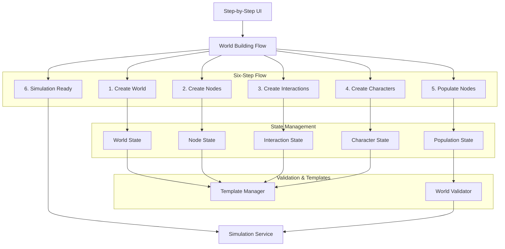

# Design Document

## Overview

This design implements a manual, step-by-step world building system that follows the World Building Flow specification. The system is mappless (nodes are abstract contexts without spatial coordinates) and capability-driven (characters are defined by what they can DO through interactions). The architecture enforces a strict six-step dependency chain: Create World → Create Nodes → Create Interactions → Create Characters → Populate Nodes → Simulation Ready.

The design integrates with the existing template system to enable saving and reusing any component while maintaining complete user control over the world building process. Every step includes validation to ensure proper dependencies are met before proceeding to the next phase.

## Architecture

### High-Level Architecture



### Six-Step World Building Flow

1. **Step 1 - Create World**: User defines world name, description, rules, and initial conditions (no spatial properties)
2. **Step 2 - Create Nodes**: User creates abstract locations/contexts with environmental properties and cultural context
3. **Step 3 - Create Interactions**: User defines character capabilities (economic, social, combat, crafting, etc.)
4. **Step 4 - Create Characters**: User creates NPCs with D&D attributes and assigns specific interaction capabilities
5. **Step 5 - Populate Nodes**: User assigns characters to nodes, ensuring each node has at least one character
6. **Step 6 - Simulation Ready**: System validates all dependencies and enables simulation start

## Components and Interfaces

### World Builder System

#### WorldBuilder Class
```javascript
class WorldBuilder {
  constructor(templateManager) {
    this.templateManager = templateManager;
    this.currentStep = 1;
    this.worldConfig = {
      // Step 1: World properties (no spatial dimensions)
      name: null,
      description: null,
      rules: null,
      initialConditions: null,
      
      // Step 2: Abstract nodes (no coordinates)
      nodes: [],
      
      // Step 3: Character capabilities
      interactions: [],
      
      // Step 4: Characters with assigned capabilities
      characters: [],
      
      // Step 5: Character-to-node assignments
      nodePopulations: {},
      
      // Validation state
      isComplete: false,
      isValid: false,
      stepValidation: {
        1: false, // World created
        2: false, // Nodes created
        3: false, // Interactions created
        4: false, // Characters created
        5: false, // Nodes populated
        6: false  // Ready for simulation
      }
    };
  }

  // Step 1: World creation methods (no spatial dimensions)
  setWorldProperties(name, description) { /* ... */ }
  setRules(rules) { /* ... */ }
  setInitialConditions(conditions) { /* ... */ }
  
  // Step 2: Node creation methods (abstract locations, no coordinates)
  addNode(nodeConfig) { 
    // Requires: name, type, description, environmentalProperties, resourceAvailability, culturalContext
    // No spatial coordinates - purely conceptual
  }
  addNodeFromTemplate(templateId, customizations = {}) { /* ... */ }
  
  // Step 3: Interaction creation methods (character capabilities)
  addInteraction(interactionConfig) {
    // Requires: name, type, requirements, branches, effects, context
    // Types: economic, resource gathering, exploration, social, combat, crafting
  }
  addInteractionFromTemplate(templateId, customizations = {}) { /* ... */ }
  
  // Step 4: Character creation methods (with capability assignment)
  addCharacter(characterConfig) {
    // Requires: name, D&D attributes, personality, consciousness, assignedInteractions
    // Characters NOT placed in nodes yet
  }
  addCharacterFromTemplate(templateId, customizations = {}) { /* ... */ }
  
  // Step 5: Node population methods (assign characters to nodes)
  assignCharacterToNode(characterId, nodeId) { /* ... */ }
  populateNode(nodeId, characterIds) { /* ... */ }
  
  // Step validation methods
  validateStep(stepNumber) { /* ... */ }
  canProceedToStep(stepNumber) { /* ... */ }
  
  // Template management
  saveAsTemplate(type, name, description) { /* ... */ }
  loadFromTemplate(templateId) { /* ... */ }
  
  // Build and validation
  build() { /* returns WorldState */ }
  validate() { /* returns validation result */ }
  reset() { /* clears configuration */ }
}
```

#### useWorldBuilder Hook
```javascript
const useWorldBuilder = (templateManager) => {
  const [worldBuilder] = useState(() => new WorldBuilder(templateManager));
  const [worldConfig, setWorldConfig] = useState(worldBuilder.worldConfig);
  const [currentStep, setCurrentStep] = useState(1);
  const [validationStatus, setValidationStatus] = useState(null);
  const [availableTemplates, setAvailableTemplates] = useState({
    worlds: [],
    nodes: [],
    interactions: [],
    characters: [],
    composite: []
  });

  // Template management
  const loadTemplates = useCallback(async () => {
    const templates = {
      worlds: templateManager.getAllTemplates('worlds'),
      nodes: templateManager.getAllTemplates('nodes'),
      interactions: templateManager.getAllTemplates('interactions'),
      characters: templateManager.getAllTemplates('characters'),
      composite: templateManager.getAllTemplates('composite')
    };
    setAvailableTemplates(templates);
  }, [templateManager]);

  // Step 1: World creation methods (no dimensions)
  const setWorldProperties = (name, description) => { /* ... */ };
  const setRules = (rules) => { /* ... */ };
  const setInitialConditions = (conditions) => { /* ... */ };
  
  // Step 2: Node creation methods (abstract locations)
  const addNode = (nodeConfig) => { /* ... */ };
  const addNodeFromTemplate = (templateId, customizations) => { /* ... */ };
  const removeNode = (nodeId) => { /* ... */ };
  
  // Step 3: Interaction creation methods (character capabilities)
  const addInteraction = (interactionConfig) => { /* ... */ };
  const addInteractionFromTemplate = (templateId, customizations) => { /* ... */ };
  const removeInteraction = (interactionId) => { /* ... */ };
  
  // Step 4: Character creation methods (with capability assignment)
  const addCharacter = (characterConfig) => { /* ... */ };
  const addCharacterFromTemplate = (templateId, customizations) => { /* ... */ };
  const removeCharacter = (characterId) => { /* ... */ };
  
  // Step 5: Node population methods
  const assignCharacterToNode = (characterId, nodeId) => { /* ... */ };
  const populateNode = (nodeId, characterIds) => { /* ... */ };
  
  // Step navigation and validation
  const canProceedToStep = (stepNumber) => { /* ... */ };
  const proceedToStep = (stepNumber) => { /* ... */ };
  const validateCurrentStep = () => { /* ... */ };
  
  // Template management
  const saveAsTemplate = (type, name, description) => { /* ... */ };
  const loadFromTemplate = (templateId) => { /* ... */ };
  
  // Final world building
  const validateWorld = () => { /* ... */ };
  const buildWorld = () => { /* ... */ };
  const resetBuilder = () => { /* ... */ };

  return {
    worldConfig,
    currentStep,
    validationStatus,
    availableTemplates,
    loadTemplates,
    setWorldProperties,
    setRules,
    setInitialConditions,
    addNode,
    addNodeFromTemplate,
    removeNode,
    addInteraction,
    addInteractionFromTemplate,
    removeInteraction,
    addCharacter,
    addCharacterFromTemplate,
    removeCharacter,
    assignCharacterToNode,
    populateNode,
    canProceedToStep,
    proceedToStep,
    validateCurrentStep,
    saveAsTemplate,
    loadFromTemplate,
    validateWorld,
    buildWorld,
    resetBuilder
  };
};
```

### Template Integration System

#### TemplateIntegrationService Class
```javascript
class TemplateIntegrationService {
  constructor(templateManager) {
    this.templateManager = templateManager;
  }

  // Create content from templates with customizations
  createFromTemplate(type, templateId, customizations = {}) {
    const template = this.templateManager.getTemplate(type, templateId);
    if (!template) {
      throw new Error(`Template not found: ${templateId}`);
    }

    return this.applyCustomizations(template, customizations);
  }

  // Apply customizations to template
  applyCustomizations(template, customizations) {
    const instance = { ...template };
    
    // Apply field-level customizations
    Object.keys(customizations).forEach(key => {
      if (customizations[key] !== undefined) {
        instance[key] = customizations[key];
      }
    });

    // Generate unique ID for instance
    instance.id = this.generateInstanceId(template.id);
    instance.templateId = template.id;
    instance.isTemplateInstance = true;

    return instance;
  }

  // Save current world content as templates
  saveWorldAsTemplates(worldConfig, templateNames) {
    const savedTemplates = {};

    if (templateNames.characters && worldConfig.characters.length > 0) {
      savedTemplates.characters = this.createCharacterTemplates(
        worldConfig.characters, 
        templateNames.characters
      );
    }

    if (templateNames.nodes && worldConfig.nodes.length > 0) {
      savedTemplates.nodes = this.createNodeTemplates(
        worldConfig.nodes, 
        templateNames.nodes
      );
    }

    // Similar for other content types...

    return savedTemplates;
  }

  // Create character templates from world characters
  createCharacterTemplates(characters, templateName) {
    return characters.map((character, index) => {
      const template = {
        ...character,
        id: `${templateName}_character_${index}`,
        name: `${templateName} Character ${index + 1}`,
        description: `Character template created from ${templateName} world`,
        isTemplate: true
      };

      this.templateManager.addTemplate('characters', template);
      return template;
    });
  }

  generateInstanceId(templateId) {
    return `${templateId}_instance_${Date.now()}_${Math.random().toString(36).substr(2, 9)}`;
  }
}
```

### World Validation System

#### WorldValidator Class
```javascript
class WorldValidator {
  static validate(worldConfig) {
    const errors = [];
    const warnings = [];
    const stepValidation = {};

    // Step 1: Validate world properties (no dimensions)
    stepValidation[1] = this.validateWorldProperties(worldConfig);
    if (!stepValidation[1].valid) {
      errors.push(...stepValidation[1].errors);
    }

    // Step 2: Validate nodes (abstract locations, no coordinates)
    stepValidation[2] = this.validateNodes(worldConfig.nodes);
    if (!stepValidation[2].valid) {
      errors.push(...stepValidation[2].errors);
    }

    // Step 3: Validate interactions (character capabilities)
    stepValidation[3] = this.validateInteractions(worldConfig.interactions);
    if (!stepValidation[3].valid) {
      errors.push(...stepValidation[3].errors);
    }

    // Step 4: Validate characters (with assigned capabilities)
    stepValidation[4] = this.validateCharacters(worldConfig.characters, worldConfig.interactions);
    if (!stepValidation[4].valid) {
      errors.push(...stepValidation[4].errors);
    }

    // Step 5: Validate node populations (character assignments)
    stepValidation[5] = this.validateNodePopulations(worldConfig.nodePopulations, worldConfig.nodes, worldConfig.characters);
    if (!stepValidation[5].valid) {
      errors.push(...stepValidation[5].errors);
    }

    return {
      isValid: errors.length === 0,
      errors,
      warnings,
      stepValidation,
      completeness: this.calculateCompleteness(worldConfig)
    };
  }

  static validateWorldProperties(worldConfig) {
    const errors = [];
    
    if (!worldConfig.name || worldConfig.name.trim() === '') {
      errors.push('World name is required');
    }
    
    if (!worldConfig.description || worldConfig.description.trim() === '') {
      errors.push('World description is required');
    }
    
    if (!worldConfig.rules) {
      errors.push('World rules are required');
    }
    
    if (!worldConfig.initialConditions) {
      errors.push('Initial conditions are required');
    }

    return {
      valid: errors.length === 0,
      errors
    };
  }

  static validateNodes(nodes) {
    const errors = [];
    
    if (!Array.isArray(nodes) || nodes.length === 0) {
      errors.push('At least one node is required');
      return { valid: false, errors };
    }

    nodes.forEach((node, index) => {
      if (!node.id || !node.name) {
        errors.push(`Node ${index + 1}: ID and name are required`);
      }
      
      if (!node.type) {
        errors.push(`Node ${index + 1}: Type is required (settlement, wilderness, market, temple, etc.)`);
      }
      
      if (!node.description) {
        errors.push(`Node ${index + 1}: Description is required`);
      }
      
      // Ensure no spatial coordinates
      if (node.position || node.x !== undefined || node.y !== undefined) {
        errors.push(`Node ${index + 1}: Spatial coordinates not allowed in mappless system`);
      }
    });

    return {
      valid: errors.length === 0,
      errors
    };
  }

  static validateInteractions(interactions) {
    const errors = [];
    
    if (!Array.isArray(interactions) || interactions.length === 0) {
      errors.push('At least one interaction (character capability) is required');
      return { valid: false, errors };
    }

    interactions.forEach((interaction, index) => {
      if (!interaction.id || !interaction.name) {
        errors.push(`Interaction ${index + 1}: ID and name are required`);
      }
      
      if (!interaction.type) {
        errors.push(`Interaction ${index + 1}: Type is required (economic, resource gathering, social, combat, etc.)`);
      }
      
      if (!interaction.requirements) {
        errors.push(`Interaction ${index + 1}: Requirements are required`);
      }
      
      if (!interaction.branches || !Array.isArray(interaction.branches)) {
        errors.push(`Interaction ${index + 1}: Branches (possible outcomes) are required`);
      }
      
      if (!interaction.effects) {
        errors.push(`Interaction ${index + 1}: Effects are required`);
      }
    });

    return {
      valid: errors.length === 0,
      errors
    };
  }

  static validateCharacters(characters, interactions) {
    const errors = [];
    
    if (!Array.isArray(characters) || characters.length === 0) {
      errors.push('At least one character is required');
      return { valid: false, errors };
    }

    const interactionIds = new Set(interactions.map(i => i.id));

    characters.forEach((character, index) => {
      if (!character.id || !character.name) {
        errors.push(`Character ${index + 1}: ID and name are required`);
      }
      
      if (!character.attributes || !character.attributes.strength || !character.attributes.dexterity) {
        errors.push(`Character ${index + 1}: D&D attributes (STR, DEX, CON, INT, WIS, CHA) are required`);
      }
      
      if (!character.assignedInteractions || !Array.isArray(character.assignedInteractions) || character.assignedInteractions.length === 0) {
        errors.push(`Character ${index + 1}: Must have at least one assigned interaction (capability)`);
      } else {
        // Validate assigned interactions exist
        character.assignedInteractions.forEach(interactionId => {
          if (!interactionIds.has(interactionId)) {
            errors.push(`Character ${index + 1}: Assigned interaction '${interactionId}' does not exist`);
          }
        });
      }
      
      // Ensure characters are not yet placed in nodes at this step
      if (character.currentNodeId) {
        errors.push(`Character ${index + 1}: Should not be assigned to nodes yet (Step 5)`);
      }
    });

    return {
      valid: errors.length === 0,
      errors
    };
  }

  static validateNodePopulations(nodePopulations, nodes, characters) {
    const errors = [];
    
    if (!nodePopulations || typeof nodePopulations !== 'object') {
      errors.push('Node populations are required');
      return { valid: false, errors };
    }

    const nodeIds = new Set(nodes.map(n => n.id));
    const characterIds = new Set(characters.map(c => c.id));

    // Ensure every node has at least one character
    nodes.forEach(node => {
      if (!nodePopulations[node.id] || !Array.isArray(nodePopulations[node.id]) || nodePopulations[node.id].length === 0) {
        errors.push(`Node '${node.name}' must have at least one character assigned`);
      } else {
        // Validate assigned characters exist
        nodePopulations[node.id].forEach(characterId => {
          if (!characterIds.has(characterId)) {
            errors.push(`Node '${node.name}': Assigned character '${characterId}' does not exist`);
          }
        });
      }
    });

    return {
      valid: errors.length === 0,
      errors
    };
  }

  static calculateCompleteness(worldConfig) {
    let score = 0;
    let maxScore = 0;

    // Step 1: World properties (required)
    maxScore += 20;
    if (this.validateWorldProperties(worldConfig).valid) {
      score += 20;
    }

    // Step 2: Nodes (required)
    maxScore += 20;
    if (this.validateNodes(worldConfig.nodes).valid) {
      score += 20;
    }

    // Step 3: Interactions (required)
    maxScore += 20;
    if (this.validateInteractions(worldConfig.interactions).valid) {
      score += 20;
    }

    // Step 4: Characters (required)
    maxScore += 20;
    if (this.validateCharacters(worldConfig.characters, worldConfig.interactions).valid) {
      score += 20;
    }

    // Step 5: Node populations (required)
    maxScore += 20;
    if (this.validateNodePopulations(worldConfig.nodePopulations, worldConfig.nodes, worldConfig.characters).valid) {
      score += 20;
    }

    return score / maxScore;
  }
}
```

### World State Management

#### WorldState Class
```javascript
class WorldState {
  constructor(config) {
    this.id = generateId();
    this.name = config.name || 'Untitled World';
    this.description = config.description || '';
    this.rules = config.rules;
    this.initialConditions = config.initialConditions;
    
    // Mappless design - no spatial dimensions
    this.nodes = config.nodes || [];
    this.interactions = config.interactions || [];
    this.characters = config.characters || [];
    this.nodePopulations = config.nodePopulations || {};
    
    this.isValid = false;
    this.validationResult = null;
    this.createdAt = new Date();
    this.modifiedAt = new Date();
  }

  validate() {
    this.validationResult = WorldValidator.validate(this);
    this.isValid = this.validationResult.isValid;
    this.modifiedAt = new Date();
    return this.validationResult;
  }

  toSimulationConfig() {
    if (!this.isValid) {
      throw new Error('Cannot convert invalid world to simulation config');
    }
    
    // Convert mappless world to simulation config
    return {
      worldName: this.name,
      worldDescription: this.description,
      rules: this.rules,
      initialConditions: this.initialConditions,
      
      // Abstract nodes (no spatial coordinates)
      nodes: this.nodes.map(node => ({
        ...node,
        assignedCharacters: this.nodePopulations[node.id] || []
      })),
      
      // Character capabilities
      interactions: this.interactions,
      
      // Characters with their assigned capabilities
      characters: this.characters.map(character => ({
        ...character,
        currentNodeId: this.findCharacterNode(character.id)
      })),
      
      // Metadata
      nodeCount: this.nodes.length,
      characterCount: this.characters.length,
      interactionCount: this.interactions.length
    };
  }

  findCharacterNode(characterId) {
    for (const [nodeId, characterIds] of Object.entries(this.nodePopulations)) {
      if (characterIds.includes(characterId)) {
        return nodeId;
      }
    }
    return null;
  }

  // Template integration methods
  saveAsTemplate(templateManager, templateName) {
    const worldTemplate = {
      id: `world_${templateName}_${Date.now()}`,
      name: templateName,
      description: `World template: ${this.name}`,
      version: '1.0.0',
      tags: ['world', 'custom', 'mappless'],
      worldConfig: {
        name: this.name,
        description: this.description,
        rules: this.rules,
        initialConditions: this.initialConditions,
        nodes: this.nodes,
        interactions: this.interactions,
        characters: this.characters,
        nodePopulations: this.nodePopulations
      },
      metadata: {
        createdAt: new Date().toISOString(),
        lastModified: new Date().toISOString(),
        author: 'User',
        type: 'mappless-world'
      }
    };

    templateManager.addTemplate('worlds', worldTemplate);
    return worldTemplate;
  }
}
```

### Modified Simulation System

#### Enhanced useSimulation Hook
```javascript
const useSimulation = (worldState = null) => {
  const [simulationState, setSimulationState] = useState(null);
  const [isRunning, setIsRunning] = useState(false);
  const [isInitialized, setIsInitialized] = useState(false);
  const [initializationError, setInitializationError] = useState(null);

  // Only initialize if valid world is provided
  useEffect(() => {
    if (worldState && worldState.isValid) {
      try {
        const config = worldState.toSimulationConfig();
        const initialState = SimulationService.initialize(config);
        setSimulationState(initialState);
        setIsInitialized(true);
        setInitializationError(null);
      } catch (error) {
        setInitializationError(error.message);
        setIsInitialized(false);
      }
    } else {
      setSimulationState(null);
      setIsInitialized(false);
      setInitializationError(null);
    }
  }, [worldState]);

  // Prevent simulation start if not properly initialized
  const startSimulation = useCallback(() => {
    if (!isInitialized || !simulationState) {
      throw new Error('Cannot start simulation without valid world');
    }
    SimulationService.start();
    setIsRunning(true);
  }, [isInitialized, simulationState]);

  // Other methods remain similar but with validation checks
  // ...

  return {
    simulationState,
    isRunning,
    isInitialized,
    initializationError,
    canStart: isInitialized && !isRunning,
    startSimulation,
    stopSimulation,
    resetSimulation,
    stepSimulation
  };
};
```

#### Enhanced SimulationService
```javascript
class SimulationService {
  constructor() {
    this.worldState = null;
    this.isRunning = false;
    this.tickInterval = null;
    this.isInitialized = false;
  }

  // Modified initialize method with validation
  initialize(config = {}) {
    if (!this.validateConfig(config)) {
      throw new Error('Invalid simulation configuration');
    }

    this.worldState = generateWorld(config);
    this.isInitialized = true;
    this.saveState();
    return this.worldState;
  }

  // New validation method
  validateConfig(config) {
    // Validate required configuration properties
    if (!config.size || !config.size.width || !config.size.height) {
      return false;
    }
    if (typeof config.nodeCount !== 'number' || config.nodeCount < 1) {
      return false;
    }
    return true;
  }

  // Modified start method with initialization check
  start() {
    if (!this.isInitialized || !this.worldState) {
      throw new Error('Simulation not properly initialized');
    }
    if (this.isRunning) {
      throw new Error('Simulation already running');
    }

    this.isRunning = true;
    // ... rest of start logic
  }

  // Add method to check if ready to start
  canStart() {
    return this.isInitialized && !this.isRunning && this.worldState !== null;
  }
}
```

### User Interface Components

#### WorldBuilderInterface Component
```javascript
const WorldBuilderInterface = ({ onWorldReady, templateManager }) => {
  const {
    worldConfig,
    validationStatus,
    availableTemplates,
    updateDimensions,
    addNodeFromTemplate,
    addCharacterFromTemplate,
    addInteractionFromTemplate,
    addNode,
    addCharacter,
    validateWorld,
    buildWorld
  } = useWorldBuilder(templateManager);

  return (
    <div className="world-builder">
      <div className="builder-tabs">
        <Tab label="World Settings">
          <DimensionsEditor onUpdate={updateDimensions} />
          <RulesEditor onUpdate={updateRules} />
          <InitialConditionsEditor onUpdate={updateInitialConditions} />
        </Tab>
        
        <Tab label="Characters">
          <TemplateSelector 
            templates={availableTemplates.characters}
            onSelectTemplate={(id, customizations) => addCharacterFromTemplate(id, customizations)}
          />
          <CharacterEditor 
            characters={worldConfig.characters}
            onAdd={addCharacter}
            onRemove={removeCharacter}
          />
        </Tab>
        
        <Tab label="Nodes">
          <TemplateSelector 
            templates={availableTemplates.nodes}
            onSelectTemplate={(id, customizations) => addNodeFromTemplate(id, customizations)}
          />
          <NodeEditor 
            nodes={worldConfig.nodes}
            onAdd={addNode}
            onRemove={removeNode}
          />
        </Tab>
        
        <Tab label="Interactions">
          <TemplateSelector 
            templates={availableTemplates.interactions}
            onSelectTemplate={(id, customizations) => addInteractionFromTemplate(id, customizations)}
          />
          <InteractionEditor 
            interactions={worldConfig.interactions}
            onAdd={addInteraction}
            onRemove={removeInteraction}
          />
        </Tab>
        
        <Tab label="Events">
          <TemplateSelector 
            templates={availableTemplates.events}
            onSelectTemplate={(id, customizations) => addEventFromTemplate(id, customizations)}
          />
          <EventEditor 
            events={worldConfig.events}
            onAdd={addEvent}
            onRemove={removeEvent}
          />
        </Tab>
      </div>
      
      <ValidationPanel status={validationStatus} />
      <div className="builder-actions">
        <SaveAsTemplateButton onClick={() => saveAsTemplate('worlds', 'My World', 'Custom world template')} />
        <BuildButton onClick={buildWorld} disabled={!validationStatus?.isValid} />
      </div>
    </div>
  );
};
```

#### TemplateSelector Component
```javascript
const TemplateSelector = ({ templates, onSelectTemplate, type }) => {
  const [selectedTemplate, setSelectedTemplate] = useState(null);
  const [customizations, setCustomizations] = useState({});

  const handleTemplateSelect = (template) => {
    setSelectedTemplate(template);
    setCustomizations({});
  };

  const handleCustomizationChange = (field, value) => {
    setCustomizations(prev => ({
      ...prev,
      [field]: value
    }));
  };

  const handleAddFromTemplate = () => {
    if (selectedTemplate) {
      onSelectTemplate(selectedTemplate.id, customizations);
      setSelectedTemplate(null);
      setCustomizations({});
    }
  };

  return (
    <div className="template-selector">
      <div className="template-list">
        {templates.map(template => (
          <div 
            key={template.id}
            className={`template-item ${selectedTemplate?.id === template.id ? 'selected' : ''}`}
            onClick={() => handleTemplateSelect(template)}
          >
            <h4>{template.name}</h4>
            <p>{template.description}</p>
            <div className="template-tags">
              {template.tags.map(tag => (
                <span key={tag} className="tag">{tag}</span>
              ))}
            </div>
          </div>
        ))}
      </div>
      
      {selectedTemplate && (
        <div className="template-customization">
          <h3>Customize {selectedTemplate.name}</h3>
          <TemplateCustomizationForm 
            template={selectedTemplate}
            customizations={customizations}
            onChange={handleCustomizationChange}
          />
          <button onClick={handleAddFromTemplate}>Add to World</button>
        </div>
      )}
    </div>
  );
};
```

#### ConditionalSimulationInterface Component
```javascript
const ConditionalSimulationInterface = () => {
  const [worldState, setWorldState] = useState(null);
  const simulation = useSimulation(worldState);

  if (!worldState || !worldState.isValid) {
    return <WorldBuilderInterface onWorldReady={setWorldState} />;
  }

  if (!simulation.isInitialized) {
    return <InitializationLoader error={simulation.initializationError} />;
  }

  return <SimulationInterface simulation={simulation} />;
};
```

## Data Models

### WorldConfig Data Structure
```javascript
const worldConfigSchema = {
  dimensions: {
    width: Number,
    height: Number,
    depth: Number // optional for 3D worlds
  },
  rules: {
    physics: Object,
    interactions: Object,
    evolution: Object
  },
  initialConditions: {
    characterCount: Number,
    resourceTypes: Array,
    startingResources: Object,
    timeScale: Number
  },
  nodes: Array, // Custom node configurations
  interactions: Array, // Custom interaction definitions
  metadata: {
    name: String,
    description: String,
    tags: Array
  }
};
```

### ValidationResult Data Structure
```javascript
const validationResultSchema = {
  isValid: Boolean,
  errors: Array, // Critical issues preventing simulation
  warnings: Array, // Non-critical issues
  completeness: Number, // 0-1 scale of configuration completeness
  details: {
    dimensions: { valid: Boolean, message: String },
    nodes: { valid: Boolean, count: Number, message: String },
    interactions: { valid: Boolean, count: Number, message: String },
    resources: { valid: Boolean, message: String }
  }
};
```

## Error Handling

### Validation Error Handling
- **Configuration Errors**: Clear messages about missing or invalid properties
- **Dependency Errors**: Validation of node-interaction dependencies
- **Resource Errors**: Validation of resource availability and constraints

### Simulation Error Handling
- **Initialization Errors**: Graceful handling of world-to-simulation conversion failures
- **Runtime Errors**: Simulation stops and returns to world builder if world becomes invalid
- **State Corruption**: Automatic fallback to last known good state

### User Experience Error Handling
- **Progressive Validation**: Real-time feedback as users build worlds
- **Error Recovery**: Suggestions for fixing validation errors
- **Graceful Degradation**: Partial functionality when possible

## Testing Strategy

### Unit Testing
- **WorldBuilder**: Test all configuration methods and validation logic
- **WorldValidator**: Test validation rules for all world properties
- **WorldState**: Test state management and conversion methods
- **Enhanced Hooks**: Test conditional logic and error handling

### Integration Testing
- **World Building Flow**: Test complete world creation and validation process
- **Simulation Initialization**: Test world-to-simulation conversion
- **Error Scenarios**: Test handling of invalid configurations and runtime errors

### User Interface Testing
- **World Builder Interface**: Test user interactions and form validation
- **Conditional Rendering**: Test proper switching between builder and simulation modes
- **Error Display**: Test error message presentation and user guidance

### End-to-End Testing
- **Complete Workflow**: Test full user journey from world creation to simulation
- **State Persistence**: Test saving and loading of world configurations
- **Cross-Component Integration**: Test communication between all system components

The testing strategy ensures reliability across all new components while maintaining compatibility with existing simulation functionality.