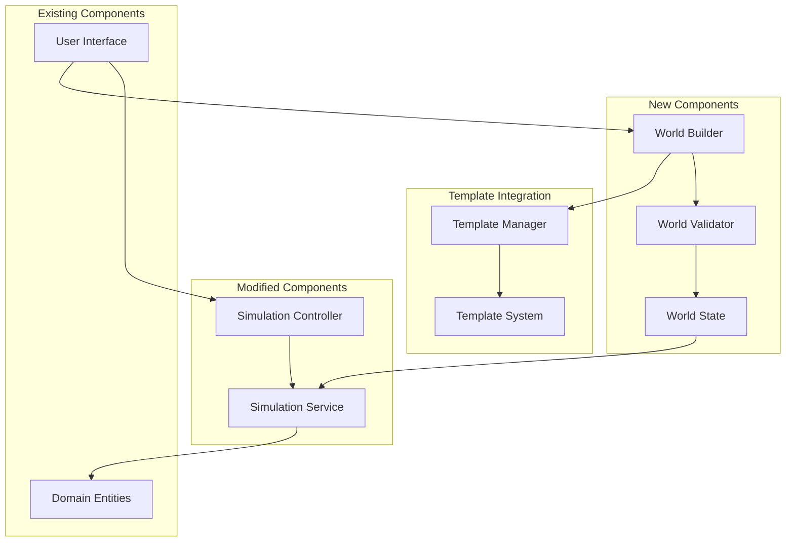

# Design Document

## Overview

This design refactors the simulation initialization system to provide controlled, world-driven simulation startup. The current system automatically initializes and potentially starts simulations on app load, which lacks user control and proper validation. The new architecture introduces a comprehensive world builder system that integrates with the existing template system, enabling users to create, customize, and manage all aspects of their simulation worlds including characters, nodes, interactions, and events.

The design follows clean architecture principles, separating world building concerns from simulation execution while leveraging the existing template system for flexible content creation and management. Users can create worlds from scratch, use predefined templates, or combine both approaches for maximum flexibility.

## Architecture

### High-Level Architecture



### Component Interaction Flow

1. **Template Selection Phase**: User browses and selects from existing templates or creates new ones
2. **World Building Phase**: User interacts with World Builder to configure world properties using templates
3. **Character/NPC Creation Phase**: User creates and customizes characters using character templates
4. **Content Population Phase**: User populates world with nodes, interactions, and events from templates
5. **Validation Phase**: World Validator ensures all required properties are set and valid
6. **Simulation Ready Phase**: Valid world state enables simulation controls
7. **Simulation Execution Phase**: Modified Simulation Service uses validated world state

## Components and Interfaces

### World Builder System

#### WorldBuilder Class
```javascript
class WorldBuilder {
  constructor(templateManager) {
    this.templateManager = templateManager;
    this.worldConfig = {
      dimensions: null,
      rules: null,
      initialConditions: null,
      nodes: [],
      characters: [],
      interactions: [],
      events: [],
      groups: [],
      items: [],
      isComplete: false,
      isValid: false
    };
  }

  // Configuration methods
  setDimensions(width, height) { /* ... */ }
  setRules(rules) { /* ... */ }
  setInitialConditions(conditions) { /* ... */ }
  
  // Template-based content creation
  addNodeFromTemplate(templateId, customizations = {}) { /* ... */ }
  addCharacterFromTemplate(templateId, customizations = {}) { /* ... */ }
  addInteractionFromTemplate(templateId, customizations = {}) { /* ... */ }
  addEventFromTemplate(templateId, customizations = {}) { /* ... */ }
  addGroupFromTemplate(templateId, customizations = {}) { /* ... */ }
  addItemFromTemplate(templateId, customizations = {}) { /* ... */ }
  
  // Direct content creation
  addNode(nodeConfig) { /* ... */ }
  addCharacter(characterConfig) { /* ... */ }
  addInteraction(interactionConfig) { /* ... */ }
  addEvent(eventConfig) { /* ... */ }
  addGroup(groupConfig) { /* ... */ }
  addItem(itemConfig) { /* ... */ }
  
  // Content removal
  removeNode(nodeId) { /* ... */ }
  removeCharacter(characterId) { /* ... */ }
  removeInteraction(interactionId) { /* ... */ }
  removeEvent(eventId) { /* ... */ }
  removeGroup(groupId) { /* ... */ }
  removeItem(itemId) { /* ... */ }
  
  // Template management
  saveAsTemplate(type, name, description) { /* ... */ }
  loadFromTemplate(templateId) { /* ... */ }
  
  // Build and validation
  build() { /* returns WorldState */ }
  validate() { /* returns validation result */ }
  reset() { /* clears configuration */ }
}
```

#### useWorldBuilder Hook
```javascript
const useWorldBuilder = (templateManager) => {
  const [worldBuilder] = useState(() => new WorldBuilder(templateManager));
  const [worldConfig, setWorldConfig] = useState(worldBuilder.worldConfig);
  const [validationStatus, setValidationStatus] = useState(null);
  const [isBuilding, setIsBuilding] = useState(false);
  const [availableTemplates, setAvailableTemplates] = useState({
    characters: [],
    nodes: [],
    interactions: [],
    events: [],
    groups: [],
    items: []
  });

  // Template management
  const loadTemplates = useCallback(async () => {
    const templates = {
      characters: templateManager.getAllTemplates('characters'),
      nodes: templateManager.getAllTemplates('nodes'),
      interactions: templateManager.getAllTemplates('interactions'),
      events: templateManager.getAllTemplates('events'),
      groups: templateManager.getAllTemplates('groups'),
      items: templateManager.getAllTemplates('items')
    };
    setAvailableTemplates(templates);
  }, [templateManager]);

  // Builder methods
  const updateDimensions = (dimensions) => { /* ... */ };
  const updateRules = (rules) => { /* ... */ };
  const updateInitialConditions = (conditions) => { /* ... */ };
  
  // Template-based content methods
  const addNodeFromTemplate = (templateId, customizations) => { /* ... */ };
  const addCharacterFromTemplate = (templateId, customizations) => { /* ... */ };
  const addInteractionFromTemplate = (templateId, customizations) => { /* ... */ };
  const addEventFromTemplate = (templateId, customizations) => { /* ... */ };
  const addGroupFromTemplate = (templateId, customizations) => { /* ... */ };
  const addItemFromTemplate = (templateId, customizations) => { /* ... */ };
  
  // Direct content methods
  const addNode = (nodeConfig) => { /* ... */ };
  const addCharacter = (characterConfig) => { /* ... */ };
  const addInteraction = (interactionConfig) => { /* ... */ };
  const addEvent = (eventConfig) => { /* ... */ };
  const addGroup = (groupConfig) => { /* ... */ };
  const addItem = (itemConfig) => { /* ... */ };
  
  // Content removal methods
  const removeNode = (nodeId) => { /* ... */ };
  const removeCharacter = (characterId) => { /* ... */ };
  const removeInteraction = (interactionId) => { /* ... */ };
  const removeEvent = (eventId) => { /* ... */ };
  const removeGroup = (groupId) => { /* ... */ };
  const removeItem = (itemId) => { /* ... */ };
  
  // Template creation from current content
  const saveAsTemplate = (type, name, description) => { /* ... */ };
  const loadFromTemplate = (templateId) => { /* ... */ };
  
  // Validation and building
  const validateWorld = () => { /* ... */ };
  const buildWorld = () => { /* ... */ };
  const resetBuilder = () => { /* ... */ };

  return {
    worldConfig,
    validationStatus,
    isBuilding,
    availableTemplates,
    loadTemplates,
    updateDimensions,
    updateRules,
    updateInitialConditions,
    addNodeFromTemplate,
    addCharacterFromTemplate,
    addInteractionFromTemplate,
    addEventFromTemplate,
    addGroupFromTemplate,
    addItemFromTemplate,
    addNode,
    addCharacter,
    addInteraction,
    addEvent,
    addGroup,
    addItem,
    removeNode,
    removeCharacter,
    removeInteraction,
    removeEvent,
    removeGroup,
    removeItem,
    saveAsTemplate,
    loadFromTemplate,
    validateWorld,
    buildWorld,
    resetBuilder
  };
};
```

### Template Integration System

#### TemplateIntegrationService Class
```javascript
class TemplateIntegrationService {
  constructor(templateManager) {
    this.templateManager = templateManager;
  }

  // Create content from templates with customizations
  createFromTemplate(type, templateId, customizations = {}) {
    const template = this.templateManager.getTemplate(type, templateId);
    if (!template) {
      throw new Error(`Template not found: ${templateId}`);
    }

    return this.applyCustomizations(template, customizations);
  }

  // Apply customizations to template
  applyCustomizations(template, customizations) {
    const instance = { ...template };
    
    // Apply field-level customizations
    Object.keys(customizations).forEach(key => {
      if (customizations[key] !== undefined) {
        instance[key] = customizations[key];
      }
    });

    // Generate unique ID for instance
    instance.id = this.generateInstanceId(template.id);
    instance.templateId = template.id;
    instance.isTemplateInstance = true;

    return instance;
  }

  // Save current world content as templates
  saveWorldAsTemplates(worldConfig, templateNames) {
    const savedTemplates = {};

    if (templateNames.characters && worldConfig.characters.length > 0) {
      savedTemplates.characters = this.createCharacterTemplates(
        worldConfig.characters, 
        templateNames.characters
      );
    }

    if (templateNames.nodes && worldConfig.nodes.length > 0) {
      savedTemplates.nodes = this.createNodeTemplates(
        worldConfig.nodes, 
        templateNames.nodes
      );
    }

    // Similar for other content types...

    return savedTemplates;
  }

  // Create character templates from world characters
  createCharacterTemplates(characters, templateName) {
    return characters.map((character, index) => {
      const template = {
        ...character,
        id: `${templateName}_character_${index}`,
        name: `${templateName} Character ${index + 1}`,
        description: `Character template created from ${templateName} world`,
        isTemplate: true
      };

      this.templateManager.addTemplate('characters', template);
      return template;
    });
  }

  generateInstanceId(templateId) {
    return `${templateId}_instance_${Date.now()}_${Math.random().toString(36).substr(2, 9)}`;
  }
}
```

### World Validation System

#### WorldValidator Class
```javascript
class WorldValidator {
  static validate(worldConfig) {
    const errors = [];
    const warnings = [];

    // Validate dimensions
    if (!this.validateDimensions(worldConfig.dimensions)) {
      errors.push('Invalid or missing world dimensions');
    }

    // Validate nodes
    if (!this.validateNodes(worldConfig.nodes)) {
      errors.push('Invalid node configuration');
    }

    // Validate characters
    if (!this.validateCharacters(worldConfig.characters)) {
      errors.push('Invalid character configuration');
    }

    // Validate interactions
    if (!this.validateInteractions(worldConfig.interactions)) {
      warnings.push('Some interactions may not function properly');
    }

    // Validate events
    if (!this.validateEvents(worldConfig.events)) {
      warnings.push('Some events may not function properly');
    }

    // Validate character-node relationships
    if (!this.validateCharacterNodeRelationships(worldConfig.characters, worldConfig.nodes)) {
      errors.push('Characters must be assigned to valid nodes');
    }

    return {
      isValid: errors.length === 0,
      errors,
      warnings,
      completeness: this.calculateCompleteness(worldConfig)
    };
  }

  static validateDimensions(dimensions) {
    return dimensions && 
           typeof dimensions.width === 'number' && dimensions.width > 0 &&
           typeof dimensions.height === 'number' && dimensions.height > 0;
  }

  static validateNodes(nodes) {
    if (!Array.isArray(nodes) || nodes.length === 0) {
      return false;
    }

    return nodes.every(node => 
      node.id && 
      node.name && 
      node.position &&
      typeof node.position.x === 'number' &&
      typeof node.position.y === 'number'
    );
  }

  static validateCharacters(characters) {
    if (!Array.isArray(characters)) {
      return false;
    }

    return characters.every(character =>
      character.id &&
      character.name &&
      character.currentNodeId &&
      character.attributes &&
      typeof character.attributes === 'object'
    );
  }

  static validateInteractions(interactions) {
    if (!Array.isArray(interactions)) {
      return true; // Interactions are optional
    }

    return interactions.every(interaction =>
      interaction.id &&
      interaction.name &&
      interaction.type
    );
  }

  static validateEvents(events) {
    if (!Array.isArray(events)) {
      return true; // Events are optional
    }

    return events.every(event =>
      event.id &&
      event.name &&
      event.trigger
    );
  }

  static validateCharacterNodeRelationships(characters, nodes) {
    if (!Array.isArray(characters) || !Array.isArray(nodes)) {
      return true; // Skip if either is missing
    }

    const nodeIds = new Set(nodes.map(node => node.id));
    return characters.every(character => 
      !character.currentNodeId || nodeIds.has(character.currentNodeId)
    );
  }

  static calculateCompleteness(worldConfig) {
    let score = 0;
    let maxScore = 0;

    // Dimensions (required)
    maxScore += 20;
    if (this.validateDimensions(worldConfig.dimensions)) {
      score += 20;
    }

    // Nodes (required)
    maxScore += 30;
    if (this.validateNodes(worldConfig.nodes)) {
      score += 30;
    }

    // Characters (recommended)
    maxScore += 25;
    if (worldConfig.characters && worldConfig.characters.length > 0) {
      score += 25;
    }

    // Interactions (optional)
    maxScore += 15;
    if (worldConfig.interactions && worldConfig.interactions.length > 0) {
      score += 15;
    }

    // Events (optional)
    maxScore += 10;
    if (worldConfig.events && worldConfig.events.length > 0) {
      score += 10;
    }

    return score / maxScore;
  }
}
```

### World State Management

#### WorldState Class
```javascript
class WorldState {
  constructor(config) {
    this.id = generateId();
    this.name = config.name || 'Untitled World';
    this.dimensions = config.dimensions;
    this.rules = config.rules;
    this.initialConditions = config.initialConditions;
    this.nodes = config.nodes || [];
    this.characters = config.characters || [];
    this.interactions = config.interactions || [];
    this.events = config.events || [];
    this.groups = config.groups || [];
    this.items = config.items || [];
    this.isValid = false;
    this.validationResult = null;
    this.createdAt = new Date();
    this.modifiedAt = new Date();
  }

  validate() {
    this.validationResult = WorldValidator.validate(this);
    this.isValid = this.validationResult.isValid;
    this.modifiedAt = new Date();
    return this.validationResult;
  }

  toSimulationConfig() {
    if (!this.isValid) {
      throw new Error('Cannot convert invalid world to simulation config');
    }
    
    return {
      size: this.dimensions,
      nodeCount: this.nodes.length,
      characterCount: this.characters.length,
      resourceTypes: this.initialConditions.resourceTypes,
      customNodes: this.nodes,
      customCharacters: this.characters,
      customInteractions: this.interactions,
      customEvents: this.events,
      customGroups: this.groups,
      customItems: this.items
    };
  }

  // Template integration methods
  saveAsTemplate(templateManager, templateName) {
    const worldTemplate = {
      id: `world_${templateName}_${Date.now()}`,
      name: templateName,
      description: `World template: ${this.name}`,
      version: '1.0.0',
      tags: ['world', 'custom'],
      worldConfig: {
        dimensions: this.dimensions,
        rules: this.rules,
        initialConditions: this.initialConditions,
        nodes: this.nodes,
        characters: this.characters,
        interactions: this.interactions,
        events: this.events,
        groups: this.groups,
        items: this.items
      },
      metadata: {
        createdAt: new Date().toISOString(),
        lastModified: new Date().toISOString(),
        author: 'User'
      }
    };

    templateManager.addTemplate('worlds', worldTemplate);
    return worldTemplate;
  }
}
```

### Modified Simulation System

#### Enhanced useSimulation Hook
```javascript
const useSimulation = (worldState = null) => {
  const [simulationState, setSimulationState] = useState(null);
  const [isRunning, setIsRunning] = useState(false);
  const [isInitialized, setIsInitialized] = useState(false);
  const [initializationError, setInitializationError] = useState(null);

  // Only initialize if valid world is provided
  useEffect(() => {
    if (worldState && worldState.isValid) {
      try {
        const config = worldState.toSimulationConfig();
        const initialState = SimulationService.initialize(config);
        setSimulationState(initialState);
        setIsInitialized(true);
        setInitializationError(null);
      } catch (error) {
        setInitializationError(error.message);
        setIsInitialized(false);
      }
    } else {
      setSimulationState(null);
      setIsInitialized(false);
      setInitializationError(null);
    }
  }, [worldState]);

  // Prevent simulation start if not properly initialized
  const startSimulation = useCallback(() => {
    if (!isInitialized || !simulationState) {
      throw new Error('Cannot start simulation without valid world');
    }
    SimulationService.start();
    setIsRunning(true);
  }, [isInitialized, simulationState]);

  // Other methods remain similar but with validation checks
  // ...

  return {
    simulationState,
    isRunning,
    isInitialized,
    initializationError,
    canStart: isInitialized && !isRunning,
    startSimulation,
    stopSimulation,
    resetSimulation,
    stepSimulation
  };
};
```

#### Enhanced SimulationService
```javascript
class SimulationService {
  constructor() {
    this.worldState = null;
    this.isRunning = false;
    this.tickInterval = null;
    this.isInitialized = false;
  }

  // Modified initialize method with validation
  initialize(config = {}) {
    if (!this.validateConfig(config)) {
      throw new Error('Invalid simulation configuration');
    }

    this.worldState = generateWorld(config);
    this.isInitialized = true;
    this.saveState();
    return this.worldState;
  }

  // New validation method
  validateConfig(config) {
    // Validate required configuration properties
    if (!config.size || !config.size.width || !config.size.height) {
      return false;
    }
    if (typeof config.nodeCount !== 'number' || config.nodeCount < 1) {
      return false;
    }
    return true;
  }

  // Modified start method with initialization check
  start() {
    if (!this.isInitialized || !this.worldState) {
      throw new Error('Simulation not properly initialized');
    }
    if (this.isRunning) {
      throw new Error('Simulation already running');
    }

    this.isRunning = true;
    // ... rest of start logic
  }

  // Add method to check if ready to start
  canStart() {
    return this.isInitialized && !this.isRunning && this.worldState !== null;
  }
}
```

### User Interface Components

#### WorldBuilderInterface Component
```javascript
const WorldBuilderInterface = ({ onWorldReady, templateManager }) => {
  const {
    worldConfig,
    validationStatus,
    availableTemplates,
    updateDimensions,
    addNodeFromTemplate,
    addCharacterFromTemplate,
    addInteractionFromTemplate,
    addNode,
    addCharacter,
    validateWorld,
    buildWorld
  } = useWorldBuilder(templateManager);

  return (
    <div className="world-builder">
      <div className="builder-tabs">
        <Tab label="World Settings">
          <DimensionsEditor onUpdate={updateDimensions} />
          <RulesEditor onUpdate={updateRules} />
          <InitialConditionsEditor onUpdate={updateInitialConditions} />
        </Tab>
        
        <Tab label="Characters">
          <TemplateSelector 
            templates={availableTemplates.characters}
            onSelectTemplate={(id, customizations) => addCharacterFromTemplate(id, customizations)}
          />
          <CharacterEditor 
            characters={worldConfig.characters}
            onAdd={addCharacter}
            onRemove={removeCharacter}
          />
        </Tab>
        
        <Tab label="Nodes">
          <TemplateSelector 
            templates={availableTemplates.nodes}
            onSelectTemplate={(id, customizations) => addNodeFromTemplate(id, customizations)}
          />
          <NodeEditor 
            nodes={worldConfig.nodes}
            onAdd={addNode}
            onRemove={removeNode}
          />
        </Tab>
        
        <Tab label="Interactions">
          <TemplateSelector 
            templates={availableTemplates.interactions}
            onSelectTemplate={(id, customizations) => addInteractionFromTemplate(id, customizations)}
          />
          <InteractionEditor 
            interactions={worldConfig.interactions}
            onAdd={addInteraction}
            onRemove={removeInteraction}
          />
        </Tab>
        
        <Tab label="Events">
          <TemplateSelector 
            templates={availableTemplates.events}
            onSelectTemplate={(id, customizations) => addEventFromTemplate(id, customizations)}
          />
          <EventEditor 
            events={worldConfig.events}
            onAdd={addEvent}
            onRemove={removeEvent}
          />
        </Tab>
      </div>
      
      <ValidationPanel status={validationStatus} />
      <div className="builder-actions">
        <SaveAsTemplateButton onClick={() => saveAsTemplate('worlds', 'My World', 'Custom world template')} />
        <BuildButton onClick={buildWorld} disabled={!validationStatus?.isValid} />
      </div>
    </div>
  );
};
```

#### TemplateSelector Component
```javascript
const TemplateSelector = ({ templates, onSelectTemplate, type }) => {
  const [selectedTemplate, setSelectedTemplate] = useState(null);
  const [customizations, setCustomizations] = useState({});

  const handleTemplateSelect = (template) => {
    setSelectedTemplate(template);
    setCustomizations({});
  };

  const handleCustomizationChange = (field, value) => {
    setCustomizations(prev => ({
      ...prev,
      [field]: value
    }));
  };

  const handleAddFromTemplate = () => {
    if (selectedTemplate) {
      onSelectTemplate(selectedTemplate.id, customizations);
      setSelectedTemplate(null);
      setCustomizations({});
    }
  };

  return (
    <div className="template-selector">
      <div className="template-list">
        {templates.map(template => (
          <div 
            key={template.id}
            className={`template-item ${selectedTemplate?.id === template.id ? 'selected' : ''}`}
            onClick={() => handleTemplateSelect(template)}
          >
            <h4>{template.name}</h4>
            <p>{template.description}</p>
            <div className="template-tags">
              {template.tags.map(tag => (
                <span key={tag} className="tag">{tag}</span>
              ))}
            </div>
          </div>
        ))}
      </div>
      
      {selectedTemplate && (
        <div className="template-customization">
          <h3>Customize {selectedTemplate.name}</h3>
          <TemplateCustomizationForm 
            template={selectedTemplate}
            customizations={customizations}
            onChange={handleCustomizationChange}
          />
          <button onClick={handleAddFromTemplate}>Add to World</button>
        </div>
      )}
    </div>
  );
};
```

#### ConditionalSimulationInterface Component
```javascript
const ConditionalSimulationInterface = () => {
  const [worldState, setWorldState] = useState(null);
  const simulation = useSimulation(worldState);

  if (!worldState || !worldState.isValid) {
    return <WorldBuilderInterface onWorldReady={setWorldState} />;
  }

  if (!simulation.isInitialized) {
    return <InitializationLoader error={simulation.initializationError} />;
  }

  return <SimulationInterface simulation={simulation} />;
};
```

## Data Models

### WorldConfig Data Structure
```javascript
const worldConfigSchema = {
  dimensions: {
    width: Number,
    height: Number,
    depth: Number // optional for 3D worlds
  },
  rules: {
    physics: Object,
    interactions: Object,
    evolution: Object
  },
  initialConditions: {
    characterCount: Number,
    resourceTypes: Array,
    startingResources: Object,
    timeScale: Number
  },
  nodes: Array, // Custom node configurations
  interactions: Array, // Custom interaction definitions
  metadata: {
    name: String,
    description: String,
    tags: Array
  }
};
```

### ValidationResult Data Structure
```javascript
const validationResultSchema = {
  isValid: Boolean,
  errors: Array, // Critical issues preventing simulation
  warnings: Array, // Non-critical issues
  completeness: Number, // 0-1 scale of configuration completeness
  details: {
    dimensions: { valid: Boolean, message: String },
    nodes: { valid: Boolean, count: Number, message: String },
    interactions: { valid: Boolean, count: Number, message: String },
    resources: { valid: Boolean, message: String }
  }
};
```

## Error Handling

### Validation Error Handling
- **Configuration Errors**: Clear messages about missing or invalid properties
- **Dependency Errors**: Validation of node-interaction dependencies
- **Resource Errors**: Validation of resource availability and constraints

### Simulation Error Handling
- **Initialization Errors**: Graceful handling of world-to-simulation conversion failures
- **Runtime Errors**: Simulation stops and returns to world builder if world becomes invalid
- **State Corruption**: Automatic fallback to last known good state

### User Experience Error Handling
- **Progressive Validation**: Real-time feedback as users build worlds
- **Error Recovery**: Suggestions for fixing validation errors
- **Graceful Degradation**: Partial functionality when possible

## Testing Strategy

### Unit Testing
- **WorldBuilder**: Test all configuration methods and validation logic
- **WorldValidator**: Test validation rules for all world properties
- **WorldState**: Test state management and conversion methods
- **Enhanced Hooks**: Test conditional logic and error handling

### Integration Testing
- **World Building Flow**: Test complete world creation and validation process
- **Simulation Initialization**: Test world-to-simulation conversion
- **Error Scenarios**: Test handling of invalid configurations and runtime errors

### User Interface Testing
- **World Builder Interface**: Test user interactions and form validation
- **Conditional Rendering**: Test proper switching between builder and simulation modes
- **Error Display**: Test error message presentation and user guidance

### End-to-End Testing
- **Complete Workflow**: Test full user journey from world creation to simulation
- **State Persistence**: Test saving and loading of world configurations
- **Cross-Component Integration**: Test communication between all system components

The testing strategy ensures reliability across all new components while maintaining compatibility with existing simulation functionality.